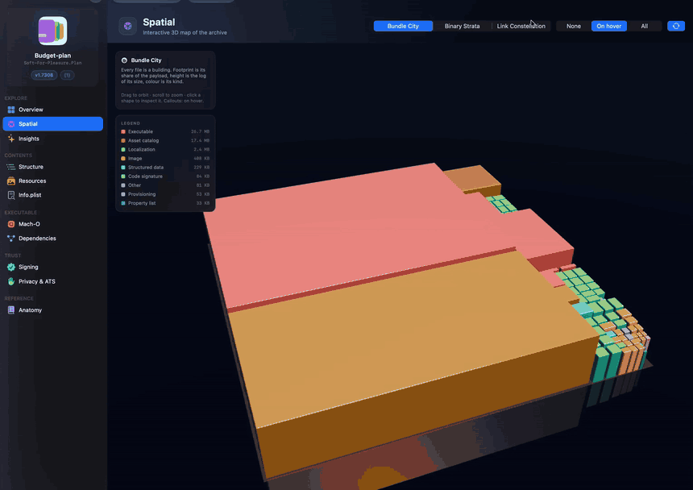

<div align="center">

# 🔍 Binary Explorer

**A native macOS app that takes an iOS `.ipa` apart — byte by byte — and shows you what's actually inside.**

Drop in an archive and get the bundle tree, the Mach-O header, the code signature, the provisioning
profile, every resource, and a 3D map of where the weight lives. No command line, no dependencies,
no server — every parser is hand-written Swift reading raw bytes.

[](https://www.apple.com/macos/)
[](https://swift.org)
[](https://developer.apple.com/xcode/swiftui/)
[](#-no-dependencies)

</div>

---

## 🎬 Preview

<div align="center">

[](example.mp4)

<sub>Orbiting the Link Constellation, pinning a linked framework, then jumping into the Dependencies table.<br>
▶︎ <b><a href="example.mp4">Watch the full-quality video</a></b></sub>

</div>

---

## 📖 Table of contents

- [What it does](#-what-it-does)
- [Feature tour](#-feature-tour)
- [What gets parsed](#-what-gets-parsed)
- [Insight engine](#-insight-engine)
- [Getting started](#-getting-started)
- [Project structure](#-project-structure)
- [Architecture](#-architecture)
- [Skills](#-skills)
- [Useful resources](#-useful-resources)

---

## ✨ What it does

An `.ipa` is just a ZIP with a very specific shape inside. Binary Explorer opens it the way a
reviewer would: it unpacks the container, indexes the payload, parses every Mach-O it finds,
decodes the embedded signature and provisioning profile, probes the compiled asset catalog, and
then turns all of it into eleven browsable views plus a findings report.

| | |
|:--|:--|
| 🧩 **Eleven inspector sections** | Overview, Spatial, Structure, Resources, Mach-O, Dependencies, Signing, Privacy & ATS, Insights, Info.plist, Anatomy |
| 🧊 **Three 3D visualisations** | Bundle City, Binary Strata and Link Constellation, rendered with SceneKit |
| 🔬 **Hand-written parsers** | ZIP (incl. ZIP64), Mach-O, code-signature SuperBlob, CMS provisioning profile, BOM asset catalog |
| 🖼 **Live resource preview** | Images, plists (tree + raw), JSON, text, fonts, media, and a hex/strings fallback |
| 🚦 **Automated findings** | 30+ rules across distribution, security, size, privacy and configuration |
| ⌘ **Global search** | One palette across files, libraries, sections, plist keys, entitlements and localizations |
| 🫧 **Everything is explained** | Each file kind, segment and signing field carries a plain-English note on *why* it's there |

---

## 🧭 Feature tour

### 📊 Overview
The landing dashboard. Archive size, installed size, executable size and file count as stat tiles;
a payload-composition bar broken down by file kind; the heaviest files in the bundle; bundle
identity (name, identifier, version, build, deployment target); build provenance (SDK, platform,
Xcode toolchain, UUID); and a "needs attention" card that links straight into the full findings.

### 🧊 Spatial — the 3D map
An interactive SceneKit stage with three modes. Drag to orbit, scroll to zoom, click any shape to
pin it in the inspector, hover for a live callout. Callouts can be turned off, shown on hover, or
pinned to every significant shape, and an idle-rotation toggle slowly turns the scene while you
read.

| Mode | What you're looking at |
|---|---|
| 🏙 **Bundle City** | Every file is a building on a squarified treemap. Footprint = share of the payload, height = log of its size, colour = file kind. |
| 🧱 **Binary Strata** | The main executable laid out as Mach-O segments and sections, stacked in file order like geological layers. |
| ✨ **Link Constellation** | Every library the executable links against, orbiting by origin — system frameworks on the outer ring, embedded code inside. |

Selecting a shape gives you its size, share of payload, VM address or install path — plus jump
buttons into the Resources, Structure, Mach-O and Dependencies sections.

### 🗂 Structure
The full bundle tree with a proportional size bar on every row. Filter by name, hide everything
under 100 KB, expand/collapse the whole tree, and select any node for an inspector showing
unpacked size, compressed size, compression ratio, share of payload and full path. Directories get
a top-ten breakdown chart. The right pane also rolls up every code-bearing nested bundle
(app extensions, watch apps, frameworks, resource bundles) and every `.lproj` localization.

### 🖼 Resources
A thumbnail grid (or list) over every file in the payload, filterable by kind and searchable by
name or path, with a live preview pane:

- **Images** — rendered with pixel dimensions, colour space, DPI, bit depth, `@2x/@3x` scale detection and a flag for Apple-optimized (CgBI) PNGs
- **Property lists** — binary or XML, shown as a collapsible tree or as raw XML
- **JSON / text / strings** — pretty-printed
- **Fonts** — full glyph specimen
- **Media** — QuickLook preview
- **`Assets.car`** — structural read-out of the compiled catalog
- **Anything else** — a hex dump with an extracted-strings view

### ⚙️ Mach-O
Everything the header and load commands will tell you: fat/universal slice picker, architecture,
CPU subtype, file type, header flags, `__TEXT` / `__DATA` / `__LINKEDIT` sizes, UUID, platform,
minimum OS, SDK, source version, entry point and PIE status. Below that, every segment expands
into its sections with VM address, file offset, size and zero-fill detection; a tally of every
load command by type; FairPlay encryption state (`cryptid`, offset, encrypted range); and a
runtime-composition read-out that tells you whether the binary carries Swift metadata, Objective-C
classes, chained fixups and an exports trie.

### 🔗 Dependencies
The link table for the primary slice: total links, embedded count, system framework count and weak
links as stat tiles, then every embedded framework, every app extension and companion app, and a
filterable table of every `LC_LOAD_DYLIB` with its install path, current version, compatibility
version and linkage kind (required, weak, re-export, upward, lazy).

### 🔐 Signing
The embedded code signature decoded from the `LC_CODE_SIGNATURE` SuperBlob: code directory
identifier, team ID, hash type and size, page size, code limit, code and special slot counts,
flags, and the computed **cdHash** — plus alternate code directories when the binary is
dual-signed. Then the full entitlements dictionary, the CMS certificate chain with issuer, serial
and validity window, the decoded `embedded.mobileprovision` (channel, expiry, provisioned devices,
team identifiers, profile certificates) and a summary of `_CodeSignature/CodeResources`.

### 🛡 Privacy & ATS
Every `NS*UsageDescription` purpose string with a character count (terse strings get flagged), the
full App Transport Security configuration including exception domains, runtime declarations
(background modes, required device capabilities, supported orientations, URL schemes,
export-compliance and scene-manifest keys) and every `PrivacyInfo.xcprivacy` manifest in the payload — app target and embedded SDKs —
with declared tracking, tracking domains, collected data types and required-reason API categories.

### ✨ Insights
The findings report, grouped by category and ranked **Critical → Warning → Notice → Healthy**.
Each finding explains what was detected, why it matters and what to do about it.

### 📄 Info.plist
A raw key browser for the app target *and* every nested bundle, switchable from a picker, with the
value tree for whichever bundle you pick.

### 📚 Anatomy
A reference section: what every part of an `.ipa` is for, whether it's required or optional, and
whether *this particular archive* has it. Useful if you're learning the format rather than
auditing a build.

### ⌘F Global search
One palette that searches files, linked libraries, Mach-O sections, Info.plist keys, entitlements
and localizations at once, with keyboard navigation. Pick a hit and it routes you to the section
that owns it, with the item already selected.

---

## 🔬 What gets parsed

Everything below is read byte-for-byte in Swift. There is no `unzip`, no `otool`, no `codesign`,
no `security`, and no third-party package.

<table>
<tr><th>Format</th><th>Implementation</th><th>Coverage</th></tr>
<tr>
<td><b>ZIP container</b></td>
<td><code>Core/ZipArchive.swift</code></td>
<td>End-of-central-directory scan, ZIP64 central directories, stored + deflate entries (via <code>Compression</code>), CRC-32 and modification dates from the central directory, POSIX permission bits from the external attributes</td>
</tr>
<tr>
<td><b>Mach-O</b></td>
<td><code>Core/MachO.swift</code></td>
<td>Fat/universal headers and per-arch slices, 32- and 64-bit headers, every load command, segments and sections with flags, <code>LC_LOAD_DYLIB</code> family, <code>LC_RPATH</code>, <code>LC_UUID</code>, <code>LC_BUILD_VERSION</code>, <code>LC_SOURCE_VERSION</code>, <code>LC_MAIN</code>, <code>LC_SYMTAB</code>, <code>LC_DYSYMTAB</code>, <code>LC_ENCRYPTION_INFO(_64)</code>, <code>LC_VERSION_MIN_*</code>, <code>LC_FUNCTION_STARTS</code>, <code>LC_DATA_IN_CODE</code>, chained fixups and exports trie</td>
</tr>
<tr>
<td><b>Code signature</b></td>
<td><code>Core/CodeSignature.swift</code></td>
<td>SuperBlob index walk, code directory versions and flags, cdHash computed with <code>CryptoKit</code>, embedded entitlements (DER and XML), CMS signer chain decoded through <code>Security</code></td>
</tr>
<tr>
<td><b>Provisioning profile</b></td>
<td><code>Core/ProvisioningProfile.swift</code></td>
<td>CMS unwrap of <code>embedded.mobileprovision</code>, plist decode, channel inference (Development / Ad Hoc / App Store / Enterprise) from the flags Apple actually ships</td>
</tr>
<tr>
<td><b>Asset catalog</b></td>
<td><code>Core/AssetCatalog.swift</code></td>
<td>BOM block table and named variables, CoreUI / storage / schema versions, rendition and named-asset counts, appearances, colours, creator, toolchain, timestamp, UUID</td>
</tr>
<tr>
<td><b>File classification</b></td>
<td><code>Core/FileKind.swift</code></td>
<td>26 kinds — executables, frameworks, dylibs, extensions, watch apps, resource bundles, asset catalogs, images, vectors, nibs, localizations, fonts, structured data, plists, databases, media, shaders, Core ML models, animations, privacy manifests, provisioning, signatures, archives, text — each with a colour, an SF Symbol and an explanation</td>
</tr>
</table>

---

## 🚦 Insight engine

`Core/InsightEngine.swift` runs the parsed bundle through the checks a reviewer would actually
make, and grades each one.

| Category | Examples of what it catches |
|---|---|
| **Distribution** | Expired or nearly-expired provisioning profile · development/ad-hoc/enterprise signing · missing export-compliance key |
| **Security** | `get-task-allow` left enabled · missing `MH_PIE` · ad-hoc or absent code signature · ATS disabled globally · ATS exception domains |
| **Binary** | FairPlay encryption state · `__TEXT` over Apple's 60 MB per-slice limit · chained fixups in use · Swift runtime shipped in-bundle |
| **Performance** | More than 12 dynamic frameworks linked at launch (dyld cost before `main()`) |
| **Size** | Archive over the 200 MB cellular download limit · oversized `Assets.car` · duplicated resources with wasted bytes quantified · essentially-incompressible payload |
| **Privacy** | Missing first-party `PrivacyInfo.xcprivacy` · SDK manifests declaring tracking |
| **Capabilities** | APNs sandbox vs production · declared background modes |
| **Configuration** | Terse purpose strings · localization coverage · old deployment targets |

---

## 🚀 Getting started

### Requirements

- macOS **14.0** or later
- Xcode **15** or later

### Build and run

```bash
git clone https://github.com/Viktorianec/BinaryExplorer.git
cd BinaryExplorer
open BinaryExplorer.xcodeproj
```

Then ⌘R. Or from the terminal:

```bash
xcodebuild -project BinaryExplorer.xcodeproj -scheme BinaryExplorer -configuration Release build
```

### Using it

1. **Drop** an `.ipa` onto the window, press **⌘O**, or open one from Finder — the app registers
   itself as a viewer for `com.apple.itunes.ipa`.
2. Watch the six-stage progress ring: *Reading archive → Unpacking payload → Indexing bundle →
   Parsing Mach-O binaries → Verifying signature → Building report*.
3. Browse the sidebar, or press **⌘F** to search everything at once.

> [!NOTE]
> App Store downloads are FairPlay-encrypted and have their provisioning profile stripped and
> replaced. Binary Explorer reports both conditions instead of guessing — everything outside the
> encrypted `__TEXT` range still reads normally. For full static analysis of `__TEXT`, use a
> development, ad-hoc or enterprise build.

> [!TIP]
> Nothing leaves your machine. The archive is unpacked into a temporary directory, read, and
> cleaned up when you open the next archive or close the current one. The app makes no network
> requests.

---

## 🗂 Project structure

```
BinaryExplorer/
├── BinaryExplorerApp.swift          # @main, window scene, menu commands, Finder open events
│
├── Core/                            # Parsing and analysis — no SwiftUI in here
│   ├── ByteReader.swift             # Bounds-checked little-endian cursor over Data
│   ├── ZipArchive.swift             # ZIP/ZIP64 reader (stored + deflate)
│   ├── MachO.swift                  # Fat headers, slices, load commands, segments, sections
│   ├── CodeSignature.swift          # SuperBlob, code directories, entitlements, CMS chain
│   ├── ProvisioningProfile.swift    # embedded.mobileprovision → channel + device list
│   ├── AssetCatalog.swift           # Compiled Assets.car (BOM) structural probe
│   ├── FileKind.swift               # 27 file kinds: colour, symbol, explanation
│   ├── IPAAnalyzer.swift            # The pipeline: unpack → index → parse → sign → report
│   ├── AnalysisModel.swift          # Immutable value types the UI renders
│   ├── InsightEngine.swift          # The findings rules
│   └── Format.swift                 # Byte, count, date and hex formatting
│
└── UI/
    ├── AppState.swift               # @MainActor store: analysis, selection, search, progress
    ├── RootView.swift               # Window shell: sidebar, router, drop target, toolbar
    ├── WelcomeView.swift            # Empty state / drop target
    ├── SearchPalette.swift          # ⌘F palette across every index
    │
    ├── Sections/                    # One file per sidebar destination
    │   ├── OverviewSection.swift
    │   ├── SpatialSection.swift
    │   ├── StructureSection.swift
    │   ├── ResourcesSection.swift
    │   ├── MachOSectionView.swift
    │   ├── DependenciesSection.swift
    │   ├── SigningSection.swift
    │   ├── PrivacySection.swift
    │   └── InsightsMetadataAnatomy.swift
    │
    ├── Components/
    │   ├── Theme.swift              # Palette, glass cards, stat tiles, rows, chips
    │   └── ResourceViewer.swift     # Image / plist / text / font / media / hex previews
    │
    └── Scene3D/
        ├── SceneBuilder.swift       # Builds the City, Strata and Constellation scenes
        ├── TreemapLayout.swift      # Squarified treemap for the city footprints
        ├── SpatialAnnotation.swift  # Billboard callouts and their placement rules
        └── SpatialSceneView.swift   # NSViewRepresentable SCNView: orbit, hit-test, hover

skills/                              # Agent skills used to build this, free to reuse
└── ipa-inspector/
    ├── SKILL.md                     # When it applies, architecture, constraints
    └── references/
        ├── formats.md               # Byte layouts: ZIP, Mach-O, code signature
        ├── macos-ui.md              # SceneKit modes, palette, interaction contract
        └── pitfalls.md              # Parsing / SceneKit / AppKit gotchas
```

---

## 🏛 Architecture

**One pass, then immutable.** `IPAAnalyzer.analyze(url:progress:)` does all the work off the main
thread and returns a single `IPAAnalysis` value. Nothing in `UI/` parses anything or mutates the
model — sections are pure functions of that value plus the current selection.

**A hard Core/UI split.** `Core/` imports `Foundation`, `Compression`, `CryptoKit` and `Security`,
never SwiftUI. That keeps the parsers testable and means every format decision lives in one place.

**Bounds-checked reads.** Every parser goes through `ByteReader`, which returns `nil` rather than
trapping on a short or malformed input. A corrupt archive produces a partial report and a warning,
not a crash.

**Selection lives in `AppState`, not in views.** That's what lets the 3D scene, the tree, the
resource grid and the search palette all cross-navigate: `state.reveal(...)` sets the target and
switches the section, and whichever view owns that identifier scrolls to it.

**Scenes are built once per token.** A SceneKit scene is expensive to construct, so
`SpatialSection` keys it to `mode | bundle path` and holds it in `@State`. The representable
compares scene *identity* before re-installing, so clicking a building never resets your camera.

### 🧼 No dependencies

No SPM packages, no CocoaPods, no Carthage, no shelling out to command-line tools. The whole thing
is Swift, SwiftUI, SceneKit and four system frameworks. Clone and build.

---

## 🧠 Skills

The agent skills used to build this app are published in [`skills/`](skills/) —
copy them into your own project's `.claude/skills/` and you get the same
byte-level knowledge of the `.ipa` format, the SceneKit conventions and the
accumulated gotchas. [`skills/README.md`](skills/README.md) explains the format
and how to write your own.

---

## 📚 Useful resources

### Apple documentation

- [Bundle Resources](https://developer.apple.com/documentation/bundleresources) — the `Info.plist`
  keys, entitlements and privacy manifest reference
- [Describing data use in privacy manifests](https://developer.apple.com/documentation/bundleresources/privacy-manifest-files) — `PrivacyInfo.xcprivacy`
- [Required reason APIs](https://developer.apple.com/documentation/bundleresources/describing-use-of-required-reason-api)
- [Preventing insecure network connections](https://developer.apple.com/documentation/security/preventing-insecure-network-connections) — App Transport Security
- [Code Signing Guide](https://developer.apple.com/library/archive/documentation/Security/Conceptual/CodeSigningGuide/Introduction/Introduction.html) (archived, still the best overview)
- [Reducing your app's size](https://developer.apple.com/documentation/xcode/reducing-your-app-s-size)
- [SceneKit](https://developer.apple.com/documentation/scenekit) · [SwiftUI](https://developer.apple.com/documentation/swiftui) · [Compression](https://developer.apple.com/documentation/compression)

### Format references

- [`mach-o/loader.h`](https://github.com/apple-oss-distributions/xnu/blob/main/EXTERNAL_HEADERS/mach-o/loader.h) — the authoritative Mach-O header layout
- [`mach-o/fat.h`](https://github.com/apple-oss-distributions/xnu/blob/main/EXTERNAL_HEADERS/mach-o/fat.h) — universal binary headers
- [`cscdefs.h`](https://github.com/apple-oss-distributions/Security/blob/main/OSX/libsecurity_codesigning/lib/cscdefs.h) — SuperBlob and code directory magic numbers
- [`codedirectory.h`](https://github.com/apple-oss-distributions/Security/blob/main/OSX/libsecurity_codesigning/lib/codedirectory.h) — code directory layout, blob types, flags and special slot indices
- [`dyld` source](https://github.com/apple-oss-distributions/dyld) — chained fixups, exports trie, load ordering
- [PKZIP APPNOTE 6.3.10](https://pkware.cachefly.net/webdocs/casestudies/APPNOTE.TXT) — the ZIP and ZIP64 specification
- [RFC 5652 — Cryptographic Message Syntax](https://datatracker.ietf.org/doc/html/rfc5652) — how `embedded.mobileprovision` is wrapped
- [Mach-O internals, explained](https://alexdremov.me/mystery-of-mach-o-object-file-builders/) · [Mach-O file format deep dive](https://github.com/aidansteele/osx-abi-macho-file-format-reference) (mirror of Apple's retired ABI reference)

### Further reading

- [Treemapping and its tiling algorithms](https://en.wikipedia.org/wiki/Treemapping) — background on *Squarified Treemaps* (Bruls, Huizing & van Wijk), the layout used by Bundle City
- [Improving app launch time](https://developer.apple.com/videos/play/wwdc2019/423/) — WWDC: why embedded dylib count matters
- [Apple: App Store download limits](https://developer.apple.com/help/app-store-connect/reference/app-file-size-limits) — the 200 MB cellular ceiling and the 60 MB per-slice executable cap
- [`otool`, `nm`, `codesign`, `vtool`](https://keith.github.io/xcode-man-pages/) — the CLI tools this app replaces, with man pages

---

<div align="center">

Built with SwiftUI and SceneKit · No dependencies · Nothing leaves your Mac

</div>
